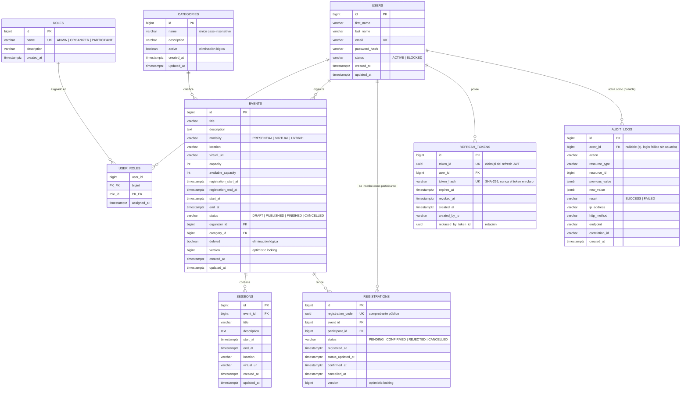
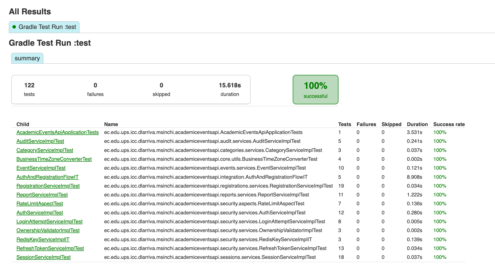

# Academic Events API

API REST para la gestión de eventos académicos, sesiones e inscripciones.

## Tabla de contenidos

- [Instalación](#instalación)
- [Modelo de datos](#modelo-de-datos)
- [Variables de entorno](#variables-de-entorno)
- [Ejecución](#ejecución)
- [Pruebas](#pruebas)
- [Despliegue](#despliegue)

## Instalación

### Requisitos

- JDK 17
- Docker Desktop (para PostgreSQL y Redis locales)
- Git

### Pasos

```bash
git clone https://github.com/DavidLarriva/academic-events-api.git
cd academic-events-api
cp .env.example .env
```

Levantar PostgreSQL y Redis:

```bash
docker compose up -d
```

Crear la base de datos (una sola vez, a mano):

```bash
docker exec -i academic-events-postgres psql -U postgres -v ON_ERROR_STOP=1 < 00_create_database.sql
```

Las tablas, relaciones y datos iniciales los crea Flyway automáticamente al
arrancar la aplicación (`V1__initial_schema_and_data.sql`) — no requiere
ningún paso manual adicional.

## Modelo de datos

Diagrama entidad-relación derivado exactamente de
`src/main/resources/db/migration/V1__initial_schema_and_data.sql` (también
disponible como archivo standalone en
[`docs/er-diagram.md`](docs/er-diagram.md)):



### Restricciones no visibles en el diagrama

- `user_roles`: clave primaria compuesta `(user_id, role_id)`; `role_id` con
  `ON DELETE RESTRICT`, `user_id` con `ON DELETE CASCADE`.
- `categories.name`: único case-insensitive vía índice funcional sobre
  `LOWER(name)`, no una `UNIQUE` plana.
- `events`: `CHECK` de coherencia modalidad↔ubicación (`PRESENTIAL` exige
  `location` y prohíbe `virtual_url`, `VIRTUAL` al revés, `HYBRID` exige
  ambos), `CHECK` de orden de fechas
  (`registration_start_at < registration_end_at <= start_at < end_at`), y
  `available_capacity BETWEEN 0 AND capacity`.
- `registrations`: `UNIQUE(event_id, participant_id)` — como máximo una fila
  por combinación, sin importar el `status` (una inscripción cancelada se
  reabre, no se vuelve a insertar).
- `refresh_tokens.replaced_by_token_id` no tiene `FOREIGN KEY` real en el
  script: es solo una referencia lógica al `token_id` de la fila que la
  reemplazó durante la rotación.
- `audit_logs.actor_id`: `ON DELETE SET NULL` (la auditoría sobrevive aunque
  se elimine el usuario referenciado).

## Variables de entorno

Ver [`.env.example`](.env.example) para los valores por defecto de
desarrollo local (ya funcionan tal cual, sin editar nada, contra el
`docker-compose.yml` de este repo).

| Variable | Uso |
|---|---|
| `DB_URL` / `DB_USERNAME` / `DB_PASSWORD` | Conexión a PostgreSQL (perfil `dev`) |
| `DB_HOST` / `DB_PORT` / `DB_NAME` | Solo los usa el perfil `prod` para componer el JDBC URL (Render no entrega uno listo) |
| `REDIS_HOST` / `REDIS_PORT` / `REDIS_PASSWORD` | Conexión a Redis |
| `REDIS_URL` | Documentada porque `docs/instrucciones.pdf` la exige como mínima, pero el YAML actual no la lee |
| `JWT_SECRET` | Secreto HS256 (mínimo 32 caracteres en prod) |
| `JWT_ACCESS_EXPIRATION` / `JWT_REFRESH_EXPIRATION` | Expiración de tokens, en milisegundos |
| `ALLOWED_ORIGINS` | Orígenes permitidos para CORS, separados por coma |
| `SWAGGER_USERNAME` / `SWAGGER_PASSWORD` | Credenciales HTTP Basic para Swagger/OpenAPI en producción |
| `PORT` | Puerto HTTP (Render lo inyecta automáticamente) |
| `SPRING_PROFILES_ACTIVE` | `dev` o `prod` |

## Ejecución

Perfil de desarrollo (por defecto):

```bash
./gradlew bootRun
```

La API queda disponible en `http://localhost:8080/api` (context-path `/api`).
Health check: `http://localhost:8080/api/actuator/health`.

Usuarios semilla (contraseña para todos: `Password123*`):

| Correo | Rol(es) |
|---|---|
| `admin@academic.test` | ADMIN |
| `maria.cordero@academic.test` | ORGANIZER + PARTICIPANT |
| `carlos.velez@academic.test` | PARTICIPANT |

## Pruebas

```bash
./gradlew test
```

Reporte HTML en `build/reports/tests/test/index.html`. Al momento de escribir
esto: **122 tests, 0 fallos, 0 errores**.



## Despliegue

`Dockerfile` y `render.yaml` en la raíz del repo. Guía paso a paso:
[`docs/deploy-render.md`](docs/deploy-render.md).

**Backend público:** https://academic-events-api-clkh.onrender.com

**Swagger UI:** https://academic-events-api-clkh.onrender.com/api/swagger-ui.html
