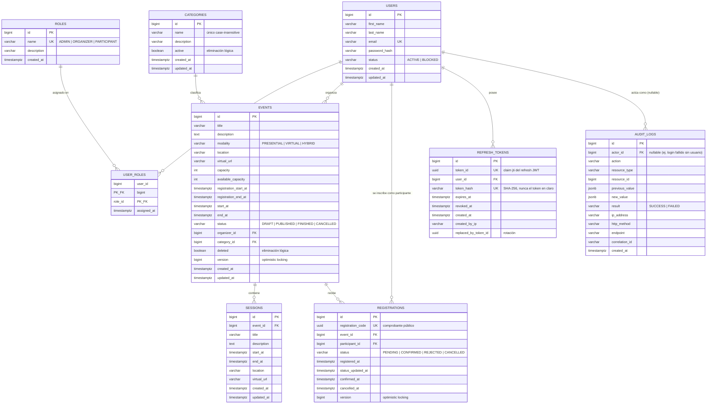

# Diagrama entidad-relación

Corresponde exactamente a `src/main/resources/db/migration/V1__initial_schema_and_data.sql`
(la migración de Flyway provista por el profesor). Este diagrama documenta ese
schema tal cual quedó definido en las 9 tablas, no un diseño aparte.

> Este mismo diagrama está embebido en el [README](../README.md#modelo-de-datos)
> — este archivo es solo una copia standalone para quien prefiera abrirlo
> directamente sin buscarlo dentro del README. Si el schema cambia, actualizar
> ambos.

## Notas sobre restricciones no visibles en el diagrama

- `user_roles`: clave primaria compuesta `(user_id, role_id)`; `role_id` con
  `ON DELETE RESTRICT`, `user_id` con `ON DELETE CASCADE`.
- `categories.name`: único case-insensitive vía índice funcional sobre
  `LOWER(name)`, no una `UNIQUE` plana.
- `events`: `CHECK` de coherencia modalidad↔ubicación (`PRESENTIAL` exige
  `location` y prohíbe `virtual_url`, `VIRTUAL` al revés, `HYBRID` exige
  ambos), `CHECK` de orden de fechas
  (`registration_start_at < registration_end_at <= start_at < end_at`), y
  `available_capacity BETWEEN 0 AND capacity`.
- `registrations`: `UNIQUE(event_id, participant_id)` — como máximo una fila
  por combinación, sin importar el `status` (una inscripción cancelada se
  reabre, no se vuelve a insertar).
- `refresh_tokens.replaced_by_token_id` no tiene `FOREIGN KEY` real en el
  script: es solo una referencia lógica al `token_id` de la fila que la
  reemplazó durante la rotación.
- `audit_logs.actor_id`: `ON DELETE SET NULL` (la auditoría sobrevive aunque
  se elimine el usuario referenciado).
